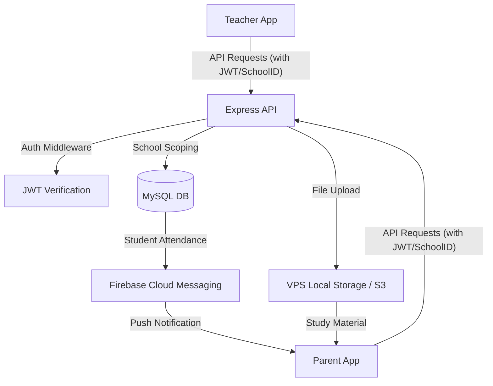

# Architecture Research

**Domain:** Multi-Tenant School Management Ecosystem
**Researched:** 2026-03-23
**Confidence:** HIGH

---

## Standard System Architecture

The DG Smart ecosystem follows a **shared-database, multi-tenant** approach for performance and single-codebase deployment.

### Component Boundaries

1. **Teacher/Parent Mobile Apps (Flutter)**
   - **Presentation Layer**: Riverpod-based reactive UI (DreamsGuider Style).
   - **Data Layer**: Dio-based API client with interceptors for auth and refresh.
   - **Local Cache**: SecureStorage for JWT, SharedPreferences for dashboard JSON.

2. **Backend API (Node.js/Express)**
   - **Middleware Layer**: JWT Auth, Role-Based Access Control (RBAC), and `school_id` Scoping.
   - **Controller Layer**: Handling specific endpoints for Attendance, Fees, Marks, etc.
   - **Service Layer**: Non-UI logic (FCM notification triggers, PDF report card generation).

3. **Database (MySQL)**
   - **Relational Integrity**: Foreign keys for `school_id` on every table.
   - **Multi-Tenant Scoping**: All queries must filter by `school_id`.

---

## Data Flow Diagram (Conceptual)

---

## Core Domain Entities

| Entity | Primary Attributes | Relationship |
|--------|---------------------|--------------|
| `schools` | id, name, board, logo_url | Tenant |
| `users` | id, school_id, role, fcm_token | Identity |
| `students` | id, user_id, class_id, parent_id | Core Record |
| `attendance` | id, student_id, date, status | Activity |
| `fees` | id, student_id, amount, status | Finance |

---

## Suggested Build Order

1. **Phase 1: Foundation**
   - MySQL Schema + Seed Data.
   - Node.js API with Auth / School-scoping middleware.
   - Flutter App Auth flow (Provider/Riverpod + Login).

2. **Phase 2: Teacher Core**
   - Attendance marking + My Classes.
   - Timetable view (Read-only + Timeline).

3. **Phase 3: Parent Core**
   - Dashboard Stats + Child selection.
   - Attendance calendar + Fees overview.

4. **Phase 4: Learning Management**
   - Homework upload (Teacher) + Submission view (Parent).
   - Study material distribution.

5. **Phase 5: Financials & Analytics**
   - Integrated Payments (Razorpay).
   - Marks Entry + Performance analytics.

---

## High-Risk Areas

- **Concurrency**: Multiple teachers marking attendance for the same class/period simultaneously.
- **Data Isolation**: A parent from School A must *never* be able to access records from School B by manipulation of IDs.
- **API Performance**: Large attendance grids (40+ students) must be paged or optimized for mobile data speeds.

---

## Sources
- Google Developer Documentation (Flutter/Firebase integration)
- Prisma/Sequelize Multi-tenancy Guide
- Node.js "Bulletproof Architecture" pattern
